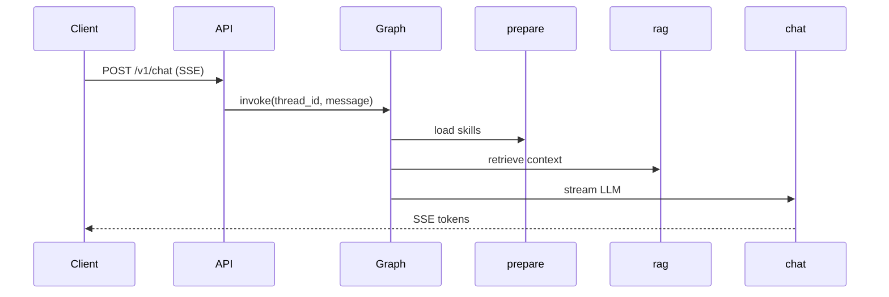
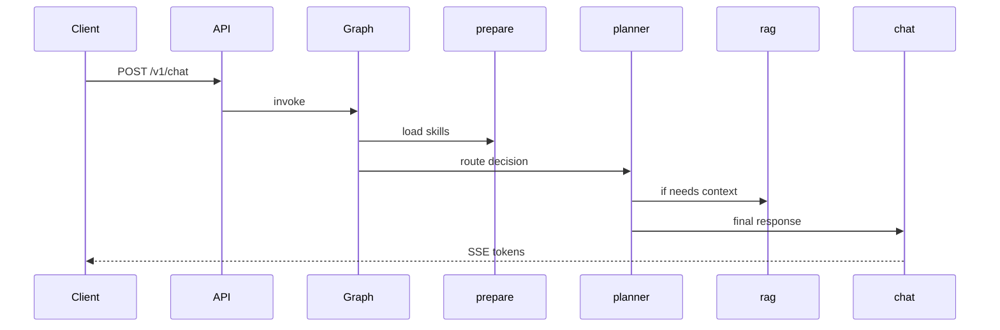

# Backend Data Flow

## Chat SSE (linear graph)

```mermaid
sequenceDiagram
  Client->>API: POST /v1/chat (SSE)
  API->>Graph: invoke(thread_id, message)
  Graph->>prepare: load skills
  Graph->>rag: retrieve context
  Graph->>chat: stream LLM
  chat-->>Client: SSE tokens
```

## Supervisor mode (optional)

```mermaid
sequenceDiagram
  Client->>API: POST /v1/chat
  API->>Graph: invoke
  Graph->>prepare: load skills
  Graph->>planner: route decision
  planner->>rag: if needs context
  planner->>chat: final response
  chat-->>Client: SSE tokens
```
