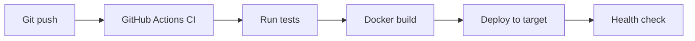

# CI/CD Pipeline

## Overview

## Service build contexts

Read `.agentflow/topology.yaml` for per-service `source` and `dockerfile` fields.
Compose export should use `build.context` per service, not a single repo root.

## Steps

1. **CI** — lint and test on pull request and main branch pushes.
2. **Build** — build Docker images from each service's `source` directory.
3. **Deploy** — apply compose or k8s manifest to the target environment.
4. **Verify** — smoke test API health endpoint and critical paths.
