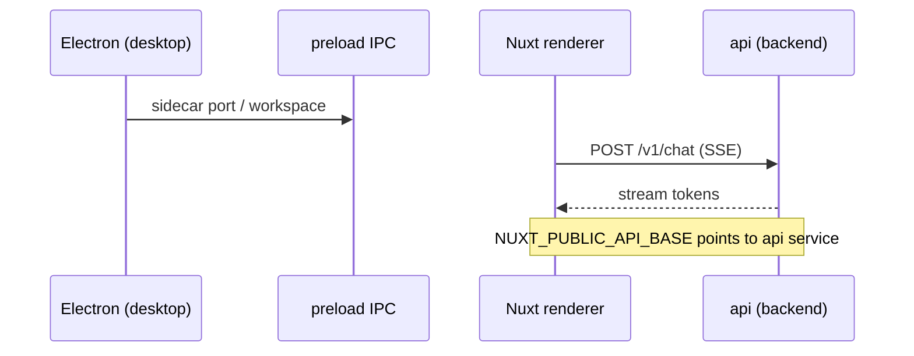
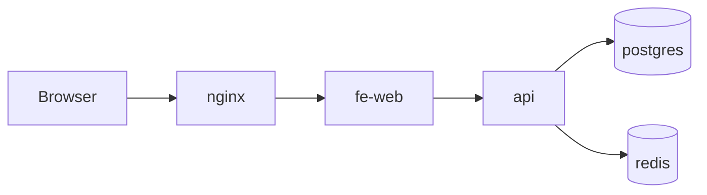

# Frontend Data Flow

## Electron → API

## Web SSR (optional fe-web service)

## CDN (static assets)

Static assets for the web build may be served via CDN in production. Document CDN origin and cache rules here; CDN is not a topology node in v1.
