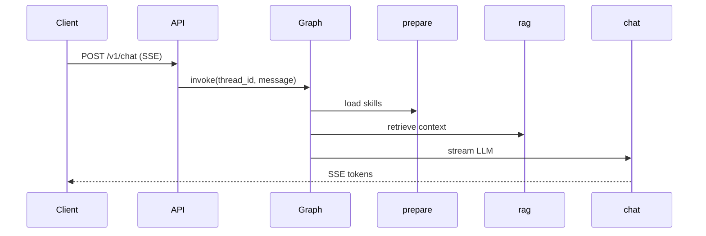
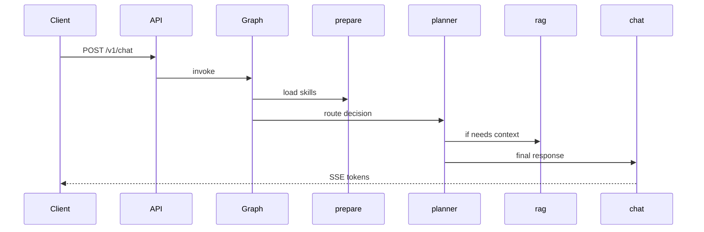

# be-dev Workspace & Mermaid Preview — Design Spec

**Status:** Approved — 2026-06-20

## 1. Purpose

Extend **Agent Flow Desktop** `be-dev` workflow step from a single read-only code explorer into a **backend developer workspace** symmetric with `fe-dev`, covering:

- Layered backend architecture planning
- **Data flow** as editable Mermaid `sequenceDiagram` (rendered in preview)
- Schema / migrations summary (read-only MVP)
- Service topology & middleware (reuse existing Topology infrastructure)
- Backend agent rules + writable code explorer

Also add **Mermaid rendering** to desktop Markdown preview so dataflow (and other docs) display diagrams inline.

**Not in scope (v1):** Interactive ER editor, live LangGraph trace viewer, visual dataflow canvas editor, schema DDL mutation from UI.

## 2. Context

### Current state

`desktop/.agentflow/workspaces/be-dev.workspace.json`:

```json
{
  "layout": "stack",
  "components": [{ "type": "code-explorer", "props": { "root": "backend", "writable": false } }]
}
```

`fe-dev.workspace.json` already provides the reference pattern: `tabs` layout with architecture plan, rules editor, domain config, and code explorer.

`MarkdownPreview.vue` uses `marked` only — **no Mermaid rendering** today.

`topology.yaml` for desktop project is empty; `resources.yaml` declares `mysql` + `redis` (template defaults). **agentFlowContainer backend** actually uses **PostgreSQL** (pgvector) + optional Redis.

### Workflow position

```
prd → architecture → fe-dev → be-dev → test → review → test-2 → cicd
```

`be-dev` step (`workflow.yaml`):

- Executor: `deepseek`
- Skill: `test-driven-development`
- Outputs: `backend/`
- Gates: `backend/` exists; `pytest -q` passes in `backend/`

## 3. Recommended approach

**Approach B — fe-dev symmetry + reuse Topology + Markdown-driven dataflow.**

| Approach | Summary | Verdict |
|----------|---------|---------|
| A | 4 new bespoke widgets (schema editor, dataflow canvas, …) | Too heavy for v1 |
| **B** | 1–2 new widgets + reuse existing components + Mermaid | **Recommended** |
| C | Topology-only; everything derived from `topology.yaml` | Misses schema & LangGraph flows |

## 4. Target `be-dev.workspace.json`

```json
{
  "version": 1,
  "stepId": "be-dev",
  "layout": "tabs",
  "components": [
    {
      "id": "arch",
      "type": "be-architecture-plan",
      "label": "分层架构",
      "props": {
        "output": "docs/be-architecture.md",
        "layers": ["api/routes", "agent/graph", "flows", "rag", "auth", "skills"]
      }
    },
    {
      "id": "dataflow",
      "type": "markdown-doc",
      "label": "数据流",
      "props": {
        "mode": "file-list",
        "files": [{ "path": "docs/be-dataflow.md", "label": "Data Flow" }],
        "editable": true
      }
    },
    {
      "id": "schema",
      "type": "schema-migrations",
      "label": "表设计",
      "props": {
        "migrationsDir": "backend/migrations",
        "output": "docs/be-schema.md"
      }
    },
    {
      "id": "topology",
      "type": "topology-panel",
      "label": "拓扑 & 中间件",
      "props": {
        "mode": "edit",
        "resourcesFile": ".agentflow/resources.yaml"
      }
    },
    {
      "id": "rules",
      "type": "agent-rules-editor",
      "label": "Backend 规则",
      "props": {
        "files": [
          { "path": "AGENTS.md", "label": "AGENTS.md" },
          { "path": "backend/README.md", "label": "Backend README" }
        ],
        "editable": true
      }
    },
    {
      "id": "code",
      "type": "code-explorer",
      "label": "代码",
      "props": {
        "root": "backend",
        "writable": true
      }
    }
  ]
}
```

### Tab responsibilities

| Tab | Widget | SSOT / output |
|-----|--------|---------------|
| 分层架构 | `be-architecture-plan` (new) | `docs/be-architecture.md` |
| 数据流 | `markdown-doc` (reuse) | `docs/be-dataflow.md` |
| 表设计 | `schema-migrations` (new) | `backend/migrations/*.sql` → summary `docs/be-schema.md` |
| 拓扑 & 中间件 | `topology-panel` (new wrapper) | `.agentflow/topology.yaml`, `.agentflow/resources.yaml` |
| Backend 规则 | `agent-rules-editor` (reuse) | `AGENTS.md`, `backend/README.md` |
| 代码 | `code-explorer` (existing) | `backend/` |

## 5. Data flow (Mermaid)

### Format

`docs/be-dataflow.md` stores one or more fenced `mermaid` blocks. Primary diagram uses `sequenceDiagram`:

````markdown
# Backend Data Flow

## Chat SSE (linear graph)



## Supervisor mode (optional)


````

Additional sections (same file or future files): RAG document sync, auth delegation, checkpoint read/write.

### Editing UX

- Reuse `MarkdownFilePanel` in **file-list** mode pointing at `docs/be-dataflow.md`
- Split view: editor (left) + preview (right) when editing; preview renders Mermaid
- Agent and developer edit raw Markdown; diagrams are not stored separately

## 6. Mermaid preview (cross-cutting)

### Requirement

Any Markdown preview in desktop (at minimum `MarkdownPreview.vue`, used by `MarkdownFilePanel`, `FeArchitecturePlanWidget`, `BeArchitecturePlanWidget`, architecture docs) must render ` ```mermaid ` code blocks as SVG diagrams.

### Implementation sketch

1. Add dependency: `mermaid` (renderer only; no bundler plugin required)
2. Extend `MarkdownPreview.vue`:
   - Custom `marked` renderer: for `language-mermaid` fences, emit `<div class="mermaid" data-mermaid="...">` instead of `<pre><code>`
   - On mount / `content` watch: call `mermaid.run({ nodes: root.querySelectorAll('.mermaid') })`
   - Handle re-render: `mermaid.run` is idempotent per element; on content change, replace inner HTML then re-run
3. Init once: `mermaid.initialize({ startOnLoad: false, theme: 'neutral', securityLevel: 'strict' })`
4. Error UX: invalid syntax → show fenced source + inline error text (do not break whole page)
5. Tests (Vitest + happy-dom):
   - Parser extracts mermaid blocks from sample markdown
   - Preview mounts without throw when mermaid present (mock `mermaid.run`)

### Security

- `securityLevel: 'strict'` — no HTML labels, no script injection from diagram text
- Diagram content is workspace-local files only (trusted dev context)

### Out of scope for Mermaid v1

- Flowchart / ER `erDiagram` editing assistants
- Export to PNG/SVG button
- Live sync with LangGraph runtime

## 7. New widgets

### 7.1 `be-architecture-plan`

Mirror `FeArchitecturePlanWidget`:

- Props: `output`, `layers[]`
- Checklist toggles layers in markdown
- Initial template when file missing
- Save via `api.writeWorkspaceFile`
- Register in `registryComponents.ts` as `"be-architecture-plan"`

### 7.2 `schema-migrations` (read-only MVP)

- List `backend/migrations/*.sql` sorted by filename
- Parse `CREATE TABLE`, `REFERENCES`, primary keys (regex-based; no full SQL parser)
- Generate / refresh `docs/be-schema.md` with table summary + optional `erDiagram` mermaid block
- UI: migration file list + generated preview (read-only); "Regenerate summary" button
- **SSOT remains SQL files** — widget does not write migrations

### 7.3 `topology-panel`

Thin wrapper embedding existing topology UI (`TopologyGraph` + node form drawer) inside workspace tab:

- Load/save `.agentflow/topology.yaml` via existing `useTopologyOps` / workspace service
- Optional read of `.agentflow/resources.yaml` to suggest node kinds (postgres not mysql for this repo)
- `mode: "edit"` in be-dev; cicd step keeps full `cicd-config` panel
- Initial topology seed for agentFlowContainer:

```yaml
version: 1
project: agentFlowContainer
nodes:
  - id: api
    kind: service
    runtime: python
    ports: [{ container: 8000, host: 8000 }]
  - id: db
    kind: database
    engine: postgres
    ports: [{ container: 5432 }]
  - id: cache
    kind: cache
    engine: redis
    ports: [{ container: 6379 }]
edges:
  - { from: api, to: db, env: { DATABASE_URL: "postgresql://..." } }
  - { from: api, to: cache, env: { REDIS_URL: "redis://..." } }
targets:
  - { id: dev, type: docker-compose, env: dev }
```

Align `resources.yaml` with postgres:

```yaml
resources:
  - { type: postgres, name: app-db, version: "16" }
  - { type: redis, name: cache }
```

## 8. Configuration & data relationships

```text
be-dev workspace
├── docs/be-architecture.md     ← module layers (static design)
├── docs/be-dataflow.md         ← runtime paths (Mermaid sequenceDiagram)
├── docs/be-schema.md           ← generated from migrations (summary)
├── .agentflow/topology.yaml    ← distributed topology (nodes + edges)
├── .agentflow/resources.yaml   ← middleware declarations
└── backend/migrations/*.sql    ← schema SSOT
         │
         ▼
    cicd step reads topology → docker-compose / deploy
```

## 9. Prompt update

Extend `templates/default-dev-cicd/prompts/be-dev.md`:

```markdown
Before implementing, read:
- docs/be-architecture.md
- docs/be-dataflow.md
- docs/be-schema.md
- .agentflow/topology.yaml

Respect layered architecture and existing schema. Run pytest before completion.
```

## 10. Error handling

| Area | Behavior |
|------|----------|
| Missing doc files | Widget creates template on first open (same as fe-architecture-plan) |
| Invalid Mermaid | Preview shows source + parse error; editor still saves |
| Empty topology | Bootstrap with default 3-node template or link to Topology Canvas settings |
| Migration parse failure | Skip table; log in summary doc as "unparsed" |

## 11. Testing

| Area | Tests |
|------|-------|
| Mermaid | `MarkdownPreview` renders mermaid div; mock `mermaid.run` |
| be-architecture-plan | Mirror `feWidgets.test.ts` patterns |
| schema-migrations | Parse sample SQL → expected table list |
| workspace config | Loader accepts new component types |
| be-dev gates | Unchanged — pytest gate still authoritative |

Run: `cd desktop && pnpm test`

## 12. Implementation phases

| Phase | Deliverable |
|-------|-------------|
| **P0** | Mermaid in `MarkdownPreview`; update `be-dev.workspace.json` (tabs + markdown-doc dataflow + rules + writable code) |
| **P0** | `be-architecture-plan` widget |
| **P1** | `schema-migrations` read-only widget |
| **P1** | `topology-panel` embed; seed topology + fix resources.yaml to postgres |
| **P2** | topology ↔ resources sync; compose export shortcut from be-dev tab |

## 13. Success criteria

- Developer opens `be-dev` step and sees 6 tabs matching fe-dev depth
- `docs/be-dataflow.md` sequenceDiagram renders inline in preview (not raw code only)
- Agent prompt references architecture, dataflow, schema, topology before coding
- `pnpm test` passes in `desktop/`
- No regression to existing fe-dev / cicd workspaces
